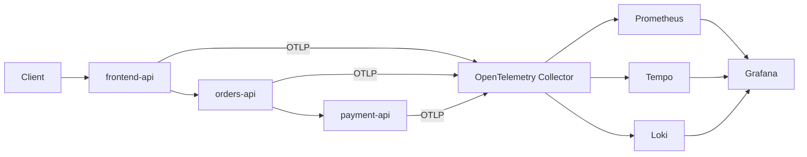

# Cloud Native Observability Platform

A vendor-neutral observability MVP for a distributed FastAPI checkout flow. It demonstrates OpenTelemetry instrumentation, a centralized Collector, and correlated traces, metrics and logs in Grafana.

## Architecture



OpenTelemetry is the application-facing telemetry layer. The Collector is the backend-neutral ingestion boundary: services do not depend on Grafana, Prometheus, Tempo or Loki SDKs.

## Technologies

- Python 3.12 and FastAPI
- OpenTelemetry SDK, OTLP/gRPC and W3C Trace Context
- OpenTelemetry Collector
- Grafana, Prometheus, Tempo and Loki
- Docker Compose and k6

## Signals

- **Traces:** a `/checkout` request crosses `frontend-api`, `orders-api`, and `payment-api` in one distributed trace.
- **Metrics:** HTTP instrumentation exports request counts and duration histograms through the Collector for Prometheus to scrape.
- **Logs:** every service emits JSON logs containing `service`, `trace_id`, and `span_id`; those logs are exported by OTLP to Loki.

## Run locally

### Prerequisites

- Docker Desktop (or Docker Engine) running
- Docker Compose v2 (`docker compose version`)
- `curl` for the smoke-test commands

### Start the stack

```bash
git clone https://github.com/crilsen/cloud-native-observability.git
cd cloud-native-observability
make up
```

Wait until the three APIs report `healthy`:

```bash
docker compose ps
```

Expected public endpoints:

| Component | URL |
| --- | --- |
| Checkout API | http://localhost:8000 |
| Grafana | http://localhost:3000 |
| Prometheus | http://localhost:9090 |
| Tempo | http://localhost:3200 |
| Loki | http://localhost:3100 |

Grafana uses the local development credentials `admin` / `admin`.

### Generate and verify telemetry

Send a normal checkout, then force the intentional slow-payment path:

```bash
curl http://localhost:8000/checkout
curl 'http://localhost:8000/checkout?slow=true'
```

Open Grafana and select **Observability / Cloud Native Observability Overview**. Give Prometheus one scrape interval (up to a few seconds) after the requests before reviewing the panels.

To create continuous traffic:

```bash
make traffic
```

To inspect startup or telemetry errors:

```bash
make logs
```

Stop the stack while retaining dashboards and telemetry data:

```bash
make down
```

To remove the local volumes as well, run `make clean`.

## Troubleshooting demo

1. Run a slow checkout with `?slow=true`.
2. In Grafana, inspect **p95 Request Latency** and identify the affected service.
3. Open a slow trace in Tempo; `payment-api /payment/process` is the dominant span.
4. Use the trace ID to query Loki and inspect the correlated JSON events.

`payment-api` is normally 50–150 ms, but 20% of non-forced requests take 800–1500 ms. `slow=true` forces a 1–2 second payment path.

## PromQL

The Collector Prometheus exporter exposes OpenTelemetry HTTP histogram data under Prometheus-normalized names. Confirm names in Prometheus' metric explorer after startup; useful queries are:

```promql
# Request rate
sum(rate(http_server_request_duration_seconds_count[5m]))

# Requests by service
sum by (service_name) (rate(http_server_request_duration_seconds_count[5m]))

# p95 request duration by service
histogram_quantile(0.95, sum by (le, service_name) (rate(http_server_request_duration_seconds_bucket[5m])))

# 5xx error rate
sum(rate(http_server_request_duration_seconds_count{http_response_status_code=~"5.."}[5m]))
```

## Commands

| Command | Purpose |
| --- | --- |
| `make up` | Build and start the stack |
| `make down` | Stop it while retaining data |
| `make logs` | Tail all Compose logs |
| `make test` | Run Python syntax and structural tests |
| `make traffic` | Run the k6 checkout scenario |
| `make clean` | Stop the stack and remove its volumes |

## Architecture decisions

- **OpenTelemetry:** portable application instrumentation and standard context propagation.
- **Collector:** centralized routing, batching and backend isolation.
- **Tempo:** trace storage optimized for Grafana trace exploration.
- **Prometheus:** pull-based metrics queries and dashboarding.
- **Loki:** cost-effective structured log storage with trace-ID correlation.
- **Grafana:** one exploration surface for all signals.

## Roadmap

- Kubernetes manifests and Helm
- Amazon EKS and Terraform
- OpenTelemetry Operator and auto-instrumentation
- Prometheus Operator and Grafana Alloy
- Exemplars, RED metrics, SLI/SLO and alerting
- Service graph, Kubernetes/infrastructure telemetry and AWS integration
- GitHub Actions enhancements
