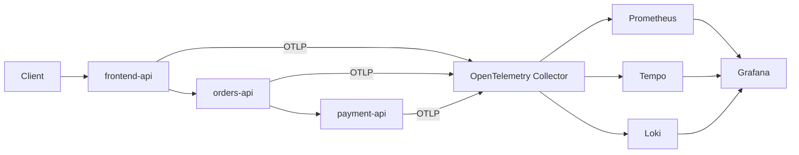

# MVP Architecture

The applications are instrumented only against OpenTelemetry APIs and export OTLP to the Collector. Backend-specific configuration is isolated from application code.

The Docker Compose deployment is deliberately local-only. It introduces no Kubernetes or cloud dependencies; a later port can preserve the OTLP boundary while replacing the runtime platform.
